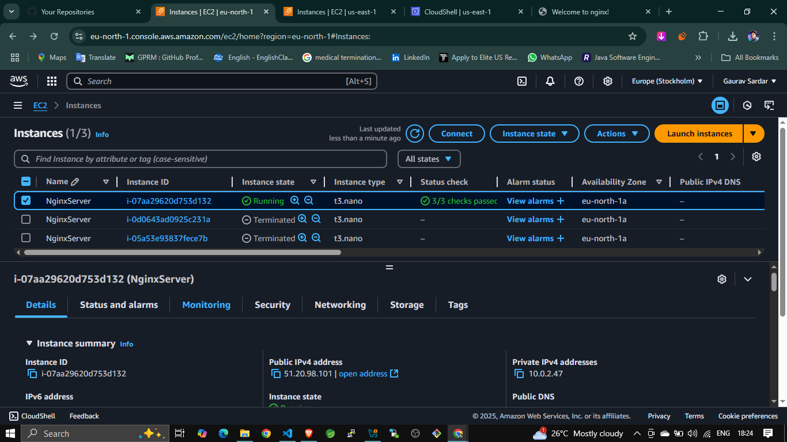
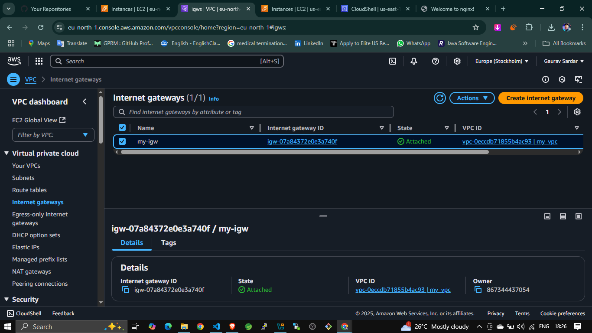

# Deploy NGINX on AWS using Terraform

This Terraform project provisions an EC2 instance inside a custom VPC, sets up networking (VPC, subnets, routing), and installs and starts the NGINX web server. It also opens HTTP access on port 80.

---

## Architecture Overview

This architecture consists of a custom VPC with one public and one private subnet, an Internet Gateway, a route table for internet access, and a security group that allows HTTP traffic. An EC2 instance is launched in the public subnet and configured with NGINX using user-data.


---

## Folder Structure

Shows the folder structure of this project.


---

## Terraform Init

Initializes Terraform and downloads the necessary providers.


---

## Terraform Plan

Shows the planned execution steps before applying the Terraform configuration.


---

## Terraform Apply

Applies the Terraform code to provision AWS infrastructure.


---

## EC2 Instance

Shows the running EC2 instance in the AWS Console.



---

## Security Group

Shows the security group that allows HTTP (port 80) access.


---

## NGINX Web Server in Browser

Shows NGINX default page accessed using the EC2 public IP.


---

## Subnets Setup

Displays the configured public and private subnets.


---

## Route Table Setup

Shows the route table associated with the public subnet.


---

## Internet Gateway Setup

Shows the attached internet gateway to the VPC.


---

## Terraform Code Overview

### provider.tf

```
provider "aws" {
  region = "eu-north-1"
}
```

### main.tf

```
terraform {
  required_providers {
    aws ={
        source = "hashicorp/aws"
        version = "5.54.1"
    }
  }
}
```

### ec2.tf

```
resource "aws_instance" "nginxserver" {
  ami                         = "ami-00f34bf9aeacdf007"
  instance_type               = "t3.nano"
  key_name                    = "Stockholem-key"
  subnet_id                   = aws_subnet.public-subnet.id
  vpc_security_group_ids      = [aws_security_group.nginx-sg.id]
  associate_public_ip_address = true

  user_data = <<-EOF
              #!/bin/bash
              sudo yum install nginx -y
              sudo systemctl enable nginx
              sudo systemctl start nginx
              EOF

  tags = {
    Name = "NginxServer"
  }
}
```

### vpc.tf

```
resource "aws_vpc" "my_vpc" {
  cidr_block = "10.0.0.0/16"
  tags = {
    Name = "my_vpc"
  }
}

resource "aws_subnet" "private-subnet" {
  cidr_block        = "10.0.1.0/24"
  vpc_id            = aws_vpc.my_vpc.id
  availability_zone = "eu-north-1a"
  tags = {
    Name = "private-subnet"
  }
}

resource "aws_subnet" "public-subnet" {
  cidr_block              = "10.0.2.0/24"
  vpc_id                  = aws_vpc.my_vpc.id
  map_public_ip_on_launch = true
  availability_zone       = "eu-north-1a"
  tags = {
    Name = "public-subnet"
  }
}

resource "aws_internet_gateway" "my-igw" {
  vpc_id = aws_vpc.my_vpc.id
  tags = {
    Name = "my-igw"
  }
}

resource "aws_route_table" "my-rt" {
  vpc_id = aws_vpc.my_vpc.id

  route {
    cidr_block = "0.0.0.0/0"
    gateway_id = aws_internet_gateway.my-igw.id
  }
}

resource "aws_route_table_association" "public-sub" {
  route_table_id = aws_route_table.my-rt.id
  subnet_id      = aws_subnet.public-subnet.id
}
```

### security\_group.tf

```
resource "aws_security_group" "nginx-sg" {
  vpc_id = aws_vpc.my_vpc.id

  ingress {
    from_port   = 80
    to_port     = 80
    protocol    = "tcp"
    cidr_blocks = ["0.0.0.0/0"]
  }

  egress {
    from_port   = 0
    to_port     = 0
    protocol    = "-1"
    cidr_blocks = ["0.0.0.0/0"]
  }

  tags = {
    Name = "nginx-sg"
  }
}
```

### output.tf

```
output "vpc_id" {
  value = aws_vpc.my_vpc.id
}

output "public_subnet_id" {
  value = aws_subnet.public-subnet.id
}

output "instance_public_ip" {
  description = "The public IP address of the EC2 instance"
  value       = aws_instance.nginxserver.public_ip
}

output "instance_url" {
  description = "The URL to access the Nginx server"
  value       = "http://${aws_instance.nginxserver.public_ip}"
}
```

---

## Conclusion

This project demonstrates the use of Terraform to provision AWS infrastructure including networking components and an EC2 instance pre-installed with NGINX. The NGINX server can be accessed via the public IP output by Terraform.


**🔗 Author:** [Gaurav Sardar](https://www.linkedin.com/in/gaurav-sardar)

