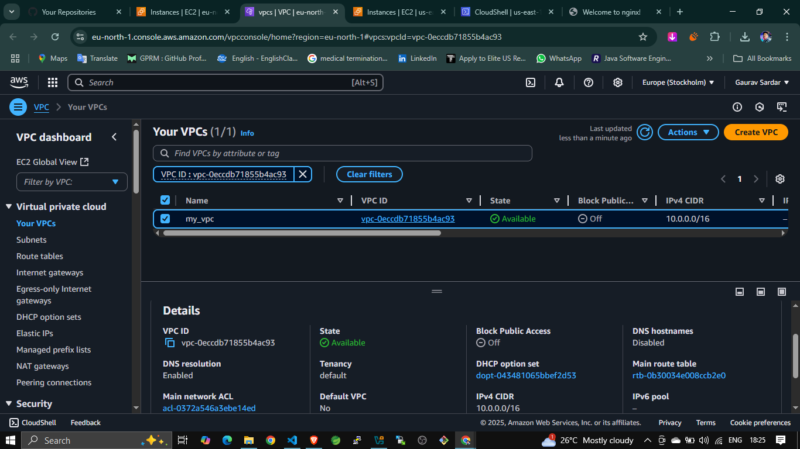

# nginx-aws-terraform
Terraform project to deploy an NGINX web server on AWS EC2 with a custom VPC, HTTP access, and public IP.
# NGINX Web Server Setup on AWS using Terraform

This project provisions an EC2 instance running **NGINX** inside a custom **VPC** on AWS using **Terraform**.

## 📁 Folder Structure


## 🧱 Components Used

* **VPC** with Public & Private Subnets
* **Internet Gateway** & **Route Table** for internet access
* **Security Group** allowing HTTP (port 80)
* **EC2 Instance** running Amazon Linux + NGINX

## 🌍 Architecture Overview



## 🚀 Getting Started

### 1. Initialize Terraform

```bash
terraform init
```


### 2. Review Plan

```bash
terraform plan
```

### 3. Apply Configuration

```bash
terraform apply
```


## 📦 Resources Created

### ✅ EC2 Instance with NGINX

* AMI: Amazon Linux 2
* Type: t3.nano
* Public IP: Outputted after apply


### ✅ Security Group for NGINX

Allows public HTTP access (port 80).


### ✅ Browser Access to NGINX

After deployment, visit the public IP in your browser:


## 🧾 Output

Terraform provides the public IP and NGINX URL:

```hcl
output "instance_public_ip" {
  value = aws_instance.nginxserver.public_ip
}

output "instance_url" {
  value = "http://${aws_instance.nginxserver.public_ip}"
}
```

## 🏗️ Networking Setup Screenshots

* **Subnets Setup**
  

* **Route Table Setup**
  

* **Internet Gateway Setup**
  !\[Internet Gateway]\(images/11-internet-getway setup.png)

---

## 🧾 Files Included

### `main.tf`

Specifies the AWS provider.

### `provider.tf`

```hcl
provider "aws" {
  region = "eu-north-1"
}
```

### `vpc.tf`

Defines custom VPC, subnets, IGW, and route table.

### `security_group.tf`

Allows HTTP traffic from anywhere.

### `ec2.tf`

Creates the EC2 instance and installs NGINX using `user_data`.

### `output.tf`

Prints useful outputs like the public IP and access URL.

---

## ✅ Conclusion

With this setup, you've automated the deployment of a basic NGINX web server using Terraform on AWS. It's a great foundation for learning infrastructure as code (IaC) and cloud provisioning!

---

**🔗 Author:** [Gaurav Sardar](https://www.linkedin.com/in/gaurav-sardar)

Feel free to ⭐ the repo and use it as a base for your own experiments with AWS and Terraform!
